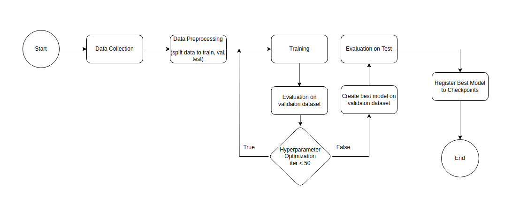
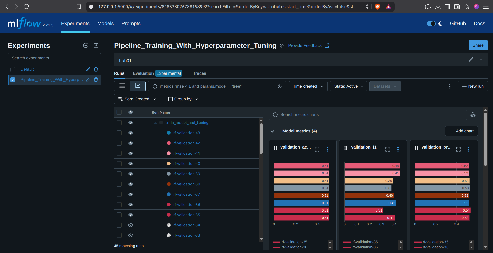
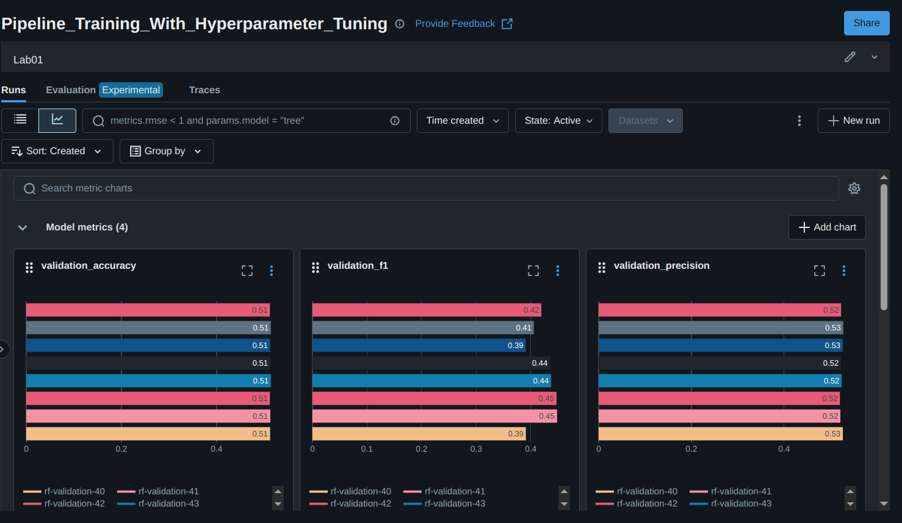

# LAB 1: Xây dựng training Pipeline dự đoán nên mua hay bán đồng Bitcoin  

## 1. Tổng quan 
### 1.1 Training pipeline được mô tả như hình sau: 



### 1.2 Giới thiệu mô hình 
#### 1.2.1 Dữ liệu 
- Dữ liệu về giá bitcoin được thu thập tại trang Binance.com thông qua API của sàn. 
- Được thu thập từ ngày 3/8/2024 - 8/4/2025  

#### 1.2.2 Giới thiệu bài toán 
- Nhóm tập trung vào sử dụng mô hình Random Forest để dự đoán nên mua hay bán Bitcoin thông qua các chỉ báo kỹ thuật.  
	+ Bán được gán là nhãn 1: Khi giá phiên sau lớn hơn giá phiên trước. 
	+ Mua được gán nhãn 0: Khi giá phiên trước nhỏ hơn giá phiên sau.  
- Bộ dữ liệu có 6 cột. Bao gồm: Datetime, Open, High, Low, Close, Volume. 
- Các chỉ báo kỹ thuật bao gồm RSI, ATR, ADX, SMI, Skew, Slope, Bbands, MACD được tạo từ thư viện ta (pandas-ta)  
 

#### 1.2.3 Mô hình 
- Mô hình được sử dụng là Random Forest nhằm dự đoán nên mua hay bán (cột Target có giá trị 0 (nên bán) hoặc 1 (nên mua). Cột Target được tính dựa trên hiệu số giá đóng cửa của phiên tiếp theo trừ phiên trước đó)

### 1.2.4 Metrics  
- Accuracy 
- Recall 
- Precision 
- F1 

## 2. Cài đặt   
**Lưu ý: Hệ điều hành sử dụng là Ubuntu 22.04.5 LTS và Python phiên bản 3.10.12**
```bash 
git clone https://github.com/HuaTanSang/MLOps.git
```
```bash 
cd MLOps
```
```bash 
pip install -r requirements.txt 
```
``` bash
python3 train.py  
```
Mở Terminal mới và nhập lệnh 
```bash 
mlflow ui
``` 

Để tracking model 

## 3. Hyper-params tuning 
Sử dụng Optuna 

## 3. Các hình ảnh demo 
- MLflow UI 


## 4. Thành viên:    
- 22521239: Hứa Tấn Sang
- 22520337: Phạm Đình Anh Duy
- 22520844: Nguyễn Đức Minh Mẫn
- 22520809: Hoàng Minh Long 

- Logging 


